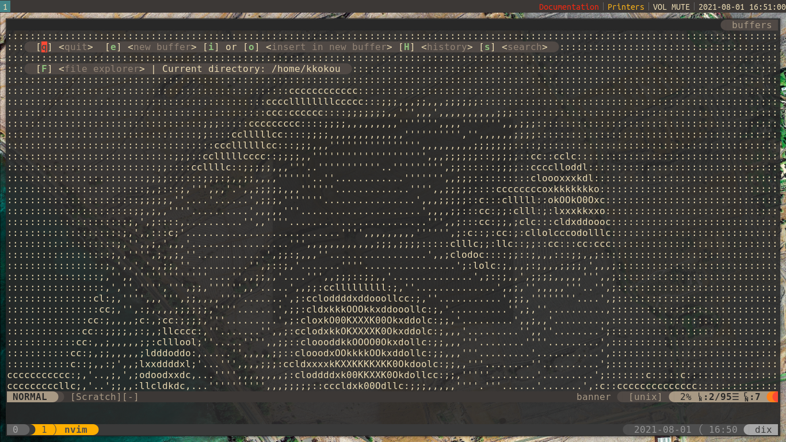

# Developement Environnement Configuration



## Installation

### Automatic Installation

#### Basic Installation

CentOs
Use Centos official installation support

Archlinux

```bash
bash <(curl -sL https://git.io/Jm3xB)
```

#### Post Installation

```bash
bash <(curl -sL https://git.io/JqZDW)
```


### Details and Manual Installation

```bash
git config --file ~/.gitconfig.local user.name "John Doe"
git config --file ~/.gitconfig.local user.email johndoe@example.com
```
